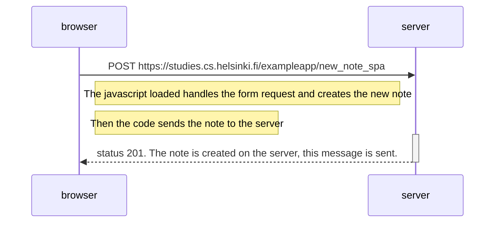

```mermaid
sequenceDiagram
participant browser
participant server

browser->>server: POST https://studies.cs.helsinki.fi/exampleapp/new_note_spa
Note right of browser: The javascript loaded handles the form request and creates the new note
Note right of browser: Then the code sends the note to the server
activate server
server-->>browser: status 201. The note is created on the server, this message is sent.
deactivate server
```
